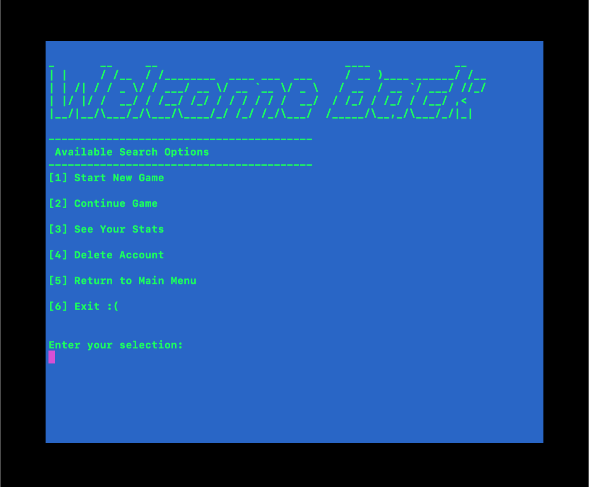

## Tree-Va Time

Tree-Va Time was inspired by the infamous typo at a local Vermont bar that was advertising its weekly "Triva Nights".
This CLI app is a simple one, allowing users to create an account, select questions from a variety of categories, get hints, and ultimately determine just how prepared they might be for the next live taping of Jeopardy!.

## Installation

 - Clone down this project repository by clicking the green "Clone or download" button above. Copy the SSH link, and open up your computer's Terminal. Inside, type "git clone <the link you've just copied>". This should open up the project: You'll see folders labeled "bin", "config", "db", "lib", etc.

 - Back in your terminal, type "bundle install".
 - Then, from the root directory, run "rake db:migrate" to create the database locally.
 - Lastly, run "rake db:seed". Now you're ready to go!

## Running the Application

To begin the game, type "ruby bin/run.rb".
Good luck!

## Playing the Game: Commands

At various points during the game, menus will pop up offering several options. You will either need to use your arrow keys to move up and down; hit ENTER to select an option. Or, you can type the number corresponding to your desired option.

In some cases, you may be asked to type yes/no. Hitting ENTER will be treated as a 'yes'. 

## Preview
Home Screen

Log-In Menu for Returning Players

Category Selection

Celebration for a Correct Answer

Player's Statistics Page

## Contributing

Contributions are most welcome. This is very much a beginner project, and constructive criticism is appreciated. Feel free to open a pull request or branch from this project.

## License

This project is licensed under the [GNU GPL](https://www.gnu.org/licenses/gpl-3.0.en.html)